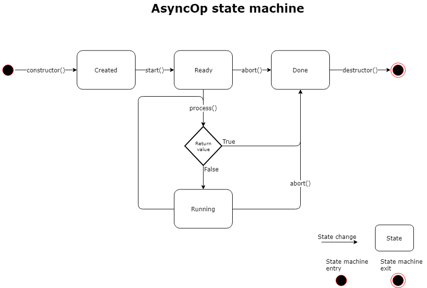

## Async Operation

### Introduction

This document provides information on the AsyncOp class along with how and when to use it.

Places to use AsyncOp
- AsynOp is helpful when a nonblocking/asynchronous API is converted to a blocking/synchronous API.
- AsynOp is helpful when each operation of a high level nonblocking/asynchronous API consists of several operations of a lower level nonblocking/asynchronous API.

Places not to use AsyncOp
- AsyncOp must not be used as part of a class's public API. AsyncOp is a utility class intended for internal use.

### How to use AsyncOp

Terms used
- async subclass - subclass of the AsyncOp
- async operation - operation performed by the async subclass
- host class - class making use of the AsyncOp subclass

Steps to use

1. Create a subclass of AsyncOp
    - Declare an async subclass in the scope of the host class so it has access to the host class's protected and private fields and methods.
    - Add state necessary to perform the async operation to the async subclass, such as a pointer to the host class's instance. Note that the constructor to AsnycOp must be passed the lock used to serialize the host class or `NULL` if the host class is serailized to a critical section.
    - Implement the `process()` method to perform each operation, returning `false` if there is more work to be done in the future or `true` if the operation is done.

1. Add code to signal the async subclass
    - Add an operation list field to the host class for the new async subclass
    ```C++
    OperationList<MyAsyncOp> op_list;
    ```
    - Signal the operation list on events relevant to the async operation
    ```C++
    op_list.signal();
    ```

1. Make use of the async subclass
    - Construct the async subclass and start the operation by adding it to the operation list:
    ```C++
    MyAsyncOp my_op(this);
    my_op.start(&op_list);
    ```
    - Wait for the async operation to finish:
    ```C++
    my_op.wait();
    ```
    - Return the return value:
    ```C++
    return my_op.my_result;
    ```


### State machine



The AsyncOp class has four distinct states - `Created`, `Ready`, `Running` and `Done`. After an AsyncOp has been constructed it is in the `Created` state. It enters the `Ready` state when it is added to an `OperationList`. Once it is at the front of the `OperationList` it enters the `Running` state. In this state `AsyncOp::process()` is called every time the `OperationList` is signaled which drives the AsnyOp's state machine.  The AsnyOp enters the `Done` state when `AsyncOp::process()` returns `true`, which indicates that processing has finished. In this state `AsyncOp::wait()` unblocks.

| State      | Functionality                                                        |
|:----------:|:--------------------------------------------------------------------:|
| Created    |    Event has been constructed                                        |
| Ready      |    Added to operation list awaiting execution                        |
| Running    |    Asnyc processing is ongoing                                       |
| Done       |    Operation is removed from execution list and wait() is unblocked  |


#### Example Usage 1 - USBCDC send

This is the synchronous send function of the ```USBCDC``` class. It uses ```AsyncOp``` (```AsyncWrite```) to connect a synchronous API to an asynchronous backend. Since all write operations are run to completion in order on ```_tx_list``` concurrent writes from different threads don't interleave.

```C++
bool USBCDC::send(uint8_t *buffer, uint32_t size)
{
    lock();

    AsyncWrite write_op(this, buffer, size);
    write_op.start(&_tx_list);      // <- Write operation enters the "Ready" state

    unlock();

    write_op.wait();                // <- Wait for the "Done" state
    return write_op.result;
}
```

This code shows the signals sent to ```AsyncWrite```. The function ```USBCDC::_send_isr```, which is called when data has been sent, sends a signal so the ```AsyncWrite``` can send more data. The function ```USBCDC::_change_terminal_connected```, which is called when a PC terminal connects or disconnects, sends a signal so ```AsyncWrite``` can finish processing on disconnect.

```C++
void USBCDC::_send_isr(usb_ep_t endpoint)
{
    assert_locked();

    write_finish(endpoint);
    _tx_buf = _tx_buffer;
    _tx_size = 0;
    _tx_in_progress = false;

    _tx_list.signal();              // <- Informs async write operation that it
                                    //    can write more data. This triggers one
                                    //    or more calls to AsyncOp::process()
    if (!_tx_in_progress) {
        data_tx();
    }
}

void USBCDC::_change_terminal_connected(bool connected)
{
    assert_locked();

    _terminal_connected = connected;
    if (!_terminal_connected) {
        // Abort TX
        if (_tx_in_progress) {
            endpoint_abort(_bulk_in);
            _tx_in_progress = false;
        }
        _tx_buf = _tx_buffer;
        _tx_size = 0;

        // Abort RX
        if (_rx_in_progress) {
            endpoint_abort(_bulk_in);
            _rx_in_progress = false;
        }
        _rx_buf = _rx_buffer;
        _rx_size = 0;

    }
    _tx_list.signal();              // <- Informs async write operation that _terminal_connected changed
    _rx_list.signal();
    _connected_list.signal();
}
```

Below is an implementation of ```AsyncOp``` (```AsyncWrite```) used for ```CDCUSB``` writes.

```C++
class USBCDC::AsyncWrite: public AsyncOp {
public:
    AsyncWrite(USBCDC *serial, uint8_t *buf, uint32_t size):
        AsyncOp(NULL), serial(serial), tx_buf(buf), tx_size(size), result(false)  { }

    virtual ~AsyncWrite()  {}

    virtual bool process()
    {
        // Check exit condition(s)
        if (!serial->_terminal_connected) {
            result = false;
            return true;
        }

        uint32_t actual_size = 0;
        serial->send_nb(tx_buf, tx_size, &actual_size, false);
        tx_size -= actual_size;
        tx_buf += actual_size;
        if (tx_size == 0) {
            // Operation finished successfully
            result = true;
            return true;
        }

        // Start transfer if it hasn't been
        serial->_send_isr_start();
        return false;
    }

    USBCDC *serial;
    uint8_t *tx_buf;
    uint32_t tx_size;
    bool result;
};
```
