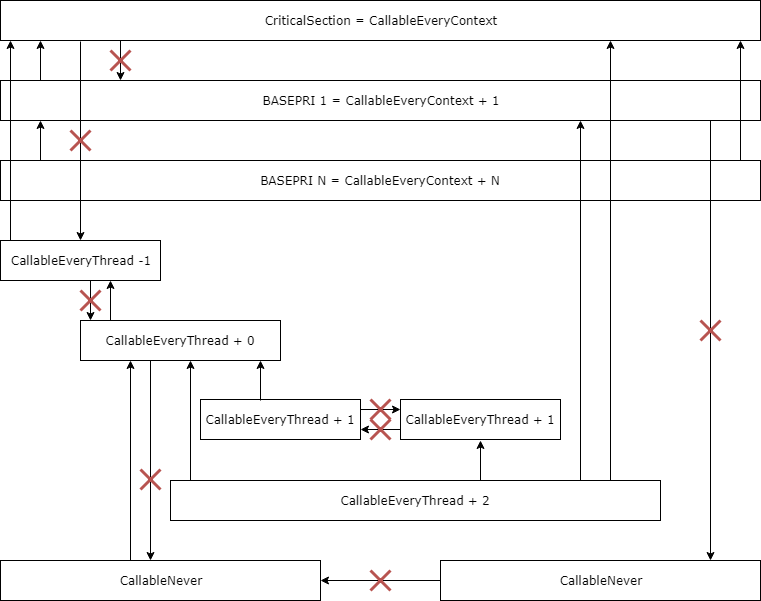

## Execution Context

### Background

The ExecutionContext class provides a general way to design async drivers and libraries which consist of or interact with other async components.

The ExecutionContext class is designed to serve three purposes:
1. Allow the application developer to choose where services execute and make the tradeoffs of latency vs memory footprint
1. Allow libraries to protect themselves from deadlocks and race conditions
1. Allow asynchronous drivers to expose a practical blocking API both with and without an RTOS

An ExecutionContext consist of two components - a lock method used to synchronously enter a given context and a post method used to enter the given context asynchronously.


### ExecutionContext API

```C++
class ExecutionContext {
    /**
    * Enter this execution context
    */
    virtual void lock() = 0;

    /**
     * Exit this execution context
     */
    virtual void unlock() = 0;

    /**
     * Run code on this execution context in the future
     *
     * When the runnable is executed the context will be locked.
     *
     * @param runnable Code to run on this execution context
     * @note This function is safe to call from any context including interrupt
     */
    virtual void post(Runnable *runnable) = 0;

    /**
     * Assert that the code is running on this execution context.
     *
     * Code can run on an execution context synchronously by calling
     * ExecutionContext::lock and ExecutionContext::unlock or
     * asynchronously by calling ExecutionContext::post.
     */
    virtual void assert_context() = 0;

    /**
     * Assert that this context can be serialized to the given context without deadlocking
     */
    void assert_callable(ExecutionContext *context);
};
```

A subclass of ExecutionContext which allows running on an EventQueue:

```C++
class EventQueueContext: public ExecutionContext {
public:

    /**
     * Create a new execution context
     *
     * @param queue Queue used for posting runnables
     */
    EventQueueContext(int order, EventQueue *queue);

    virtual ~EventQueueContext();

    virtual void lock();

    virtual void unlock();

    virtual void post(Runnable *runnable);

    virtual void assert_context();

private:
     rtos::Mutex *_mutex;
}
```

A subclass of ExecutionContext which is interrupt safe:
```C++
class CriticalContext: public ExecutionContext {
public:

    /**
     * Get the critical section execution context
     *
     * This context can be used to make any object
     * interrupt safe.
     */
    static ExecutionContext *get();

    virtual void lock();

    virtual void unlock();

    virtual void post(Runnable *runnable);

    virtual void assert_context();
}
```

### Runnable class

The Runnable class is an extension of the callback class with reserved space for use by implementations of `ExecutionContext::post`. This reserved space is used by implementations of `ExecutionContext::post` for enqueuing on their dispatch list without the need to dynamically allocate memory. This allows Runnables to be safely used from all contexts, including interrupt context, without the risk of running out of memory.

Runnable class API:

```C++
class Runnable {
public:

    /**
     * Construct a new Runnable object
     *
     * @param callback Completion callback
     */
    Runnable();

    /**
     * Set the callback for this runnable
     *
     * @param callback Callback to invoke when posted
     */
    Runnable &operator=(mbed::Callback<void()> callback);

    /**
     * Cancel the execution of this runnable
     *
     * @note cancel must only be called from the context the event was posted to
     */
    void cancel();

    /**
     * Return true if this runnable is finished
     *
     * @return true if this runnable is finished
     */
    bool finished()

    /* For use by implementations of ExecutionContext only */

    ExecutionContext *_context;
    uint32_t _context_data[4];
    mbed::Callback<void()> _callback;
}

```

### Deadlock prevention with lock ordering

The ExecutionContext class helps prevent deadlock by assigning an order value to each execution context. Contexts can lock other contexts with a lower order value than their own, but are not allowed to lock contexts with the same or higher order value.

- CallableEveryContext - Lowest order value possible. This is a critical section which always executes atomically and cannot be interrupted.
- CallableEveryThread - Lowest order value for a public API serialized to thread context. It may contain contexts internally with a lower order value, but these are not publicly exposed. All other thread can synchronously use this context.
- CallableNever - This is the highest order value. Code running in a context which is CallableNever is allowed to lock all other contexts and is never allowed to be locked itself.

Diagram showing interactions between different contexts



### Writing services which use ExecutionContext


If your class requires that its callbacks are called in its context, assert it.

```C++
class MyClass {
    ExecutionContext *_context;

    ...

    void my_callback()
    {
        _context->assert_context();
    }
}
```

If your class allows callbacks from unknown contexts then post to your class's context to handle it.

```C++
class MyClass {
    ExecutionContext *_context;
    Runnable _process;

    ...

    void my_callback()
    {
        _process = _handle_callback;
        _context.post(_process);
    }

    void _handle_callback()
    {
        ...
    }
}
```

If you require async objects passed to you to be callable make sure to assert that as well.

```C++
class MyClass {
    ExecutionContext *_context;
    SomeStream *_stream;

    MyClass(SomeStream *stream, ExecutionContext *context)
    {
        _stream = stream;
        _context = context;
        _context.assert_callable(_stream->get_context());
    }
}
```


### (Hypothetical) Case study - User choosing to run USB from interrupt or thread context

Example USB USBSerial class constructor:
```C++
class USBSerial {
    USBSerial(USBPhy *phy=get_usb_phy(), ExecutionContext *context=CriticalContext::get());
    ...
}
```

Using default USBSerial configuration (interrupt safe)

```C++
#include "mbed.h"
#include "USBSerial.h"

USBSerial serial;

int main()
{
    serial.printf("hello world");
}
```

Using USBSerial in thread mode. When running in thread mode printf and malloc can be used from all of the callbacks sent from USBSerial.

```C++
#include "mbed.h"
#include "USBSerial.h"
#include "EventQueueContext.h"

EventQueueContext usb_context(CallableEveryThread, mbed_event_queue());
USBSerial serial(get_usb_phy(), &usb_context);

int main()
{
    serial.printf("hello world");
}
```


### (Hypothetical) Case study - Services using NSAPI

Hypothetical example running a network time service along with cloud client.

In this case the `esp` and `esp_serial` are serialized to the same context, while `net_time` and `cloud` each get their own contexts, but share the `mbed_event_queue`.

```C++
#include "mbed.h"
#include "ESP8266Interface.h"
#include "NetworkTimeService.h"
#include "CloudClientService.h"
#include "EventQueueContext.h"

// Context ordering levels
const int esp_order = CallableEveryThread;
const int service_order = esp_order + 1;

// System contexts
EventQueueContext esp_context(esp_order, mbed_highprio_event_queue());
EventQueueContext net_time_context(service_order, mbed_event_queue());
EventQueueContext client_context(service_order, mbed_event_queue())

// Components
Serial esp_serial(D0, D1, &esp_context);
ESP8266Interface esp(&esp_serial, &esp_context);
NetworkTimeService net_time(&esp, &net_time_context);
CloudClientService cloud(&esp, &client_context)

int main()
{
    printf("Current time is %i\n", net_time.get_time());
}
```

In this case everything is serialized to the same context.

```C++
#include "mbed.h"
#include "ESP8266Interface.h"
#include "NetworkTimeService.h"
#include "CloudClientService.h"
#include "EventQueueContext.h"

// Same context used for everything
EventQueueContext system_context(CallableEveryThread, mbed_event_queue());

// Components
Serial esp_serial(D0, D1, &system_context);
ESP8266Interface esp(&esp_serial, &system_context);
NetworkTimeService net_time(&esp, &system_context);
CloudClientService cloud(&esp, &system_context)

int main()
{
    printf("Current time is %i\n", net_time.get_time());
}
```
